# Bitcoin Time Series Analysis & Forecasting

*This project aims to analyze Bitcoin Prices Data (2010-2024) to uncover trends and predict future price values (daily) utilizing Time Series Analysis techniques.*

## Data
[Our dataset](https://www.investing.com/crypto/bitcoin/historical-data) contains six columns: `Date`, `Price`, `Open`, `High`, `Low` and `Vol.` Its records encompass daily changes in the aforementioned metrics, starting from 2010-07-18, up to 2024-12-31.

## Team
- Kornelia Dołęga-Żaczek: *classic ML methods experimentations, LSTM & GRU fine-tuning, Prophet*
- Jacek Kała: *preprocessing, initial MA & EMA, RNNs: LSTM & GRU*
- Maria Leszczyńska: *decompostion, seasonality checks, stationarity check, visualization, smoothing, Prophet, Holt-Winters model (and RF which was a bad experiment)*
- Wioletta Wielakowska: *GARCH & ARIMA model: preparation, fine-tuning, description*

---

### Data Preprocessing
Several data inconsistencies where identified, restricting proper analysis. After disposing of the duplicated index column, the following steps were applied:
- replacing "," with empty strings, as the original data used it as the hundreds separator (columns:  `Price`, `Open`, `High`, `Low`). After that, their datatypes were replaced with floating points
- reshaping the `Date`, modifying the structure from *mm-dd-YYYY* to *YYYY-mm-dd* as the universally recognized standard, ensuring the datetime format, then sorting and setting it as the index column
- constructing new column: `Average` as the average of `High` and `Low`, which was supposed to be a more reliable metric. Ultimately, for prediction we use `Price`
- renaming columns: `Price` to `Close`, `Vol.` to `Volume`
- reconstructing `Volume` to handle *K*, *M* and *B* quantifiers, and expand them with thousand, million, billion, receiving valid numbers. This column was used in initial experimentations with time-series based neural networks
- *MinMaxScaling* was used separately before every model training, the rectified dataset was saved as **bitcoin_preprocessed**

No other anomalies or missing values were recognized.

### Data Exploration
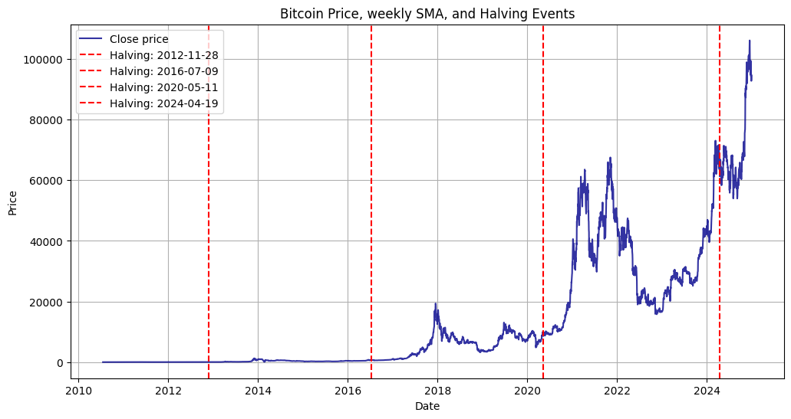
A quick look at frequency in our data:

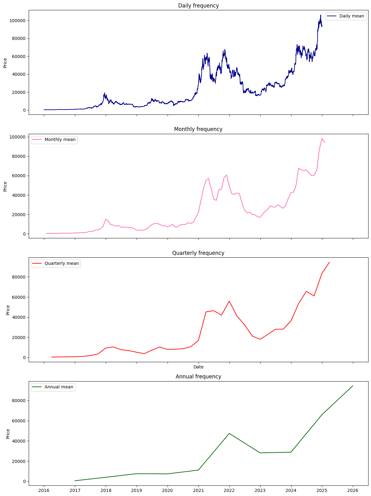

#### Stationarity check, Differencing, Logging & Logging Followed by Differencing
We tested the dataset for stationarity using the Augmented Dickey-Fuller test, which revealed that the series is not stationary. To address this, we did the following transformations:
- *differencing* - to stablilise the mean by removing trends - new column `Close_Diff` was created, where each value represents the difference between the current and previous price
- *log transformation* - to stabilise the variance - new column `Close_Log` was created
- *log differencing* - to address both non-stationary mean and variance - `Close_Log_Diff` was created where we applied log transformation first, followed by differencing

To further explore the underlying patterns in the data, **seasonal decomposition** was performed using an additive model for four key columns:
- `Price`
- `Close_Diff`
- `Close_Log`
- `Close_Log_Diff`

  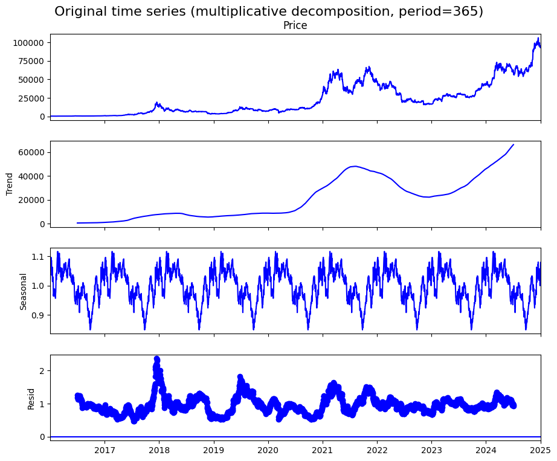
  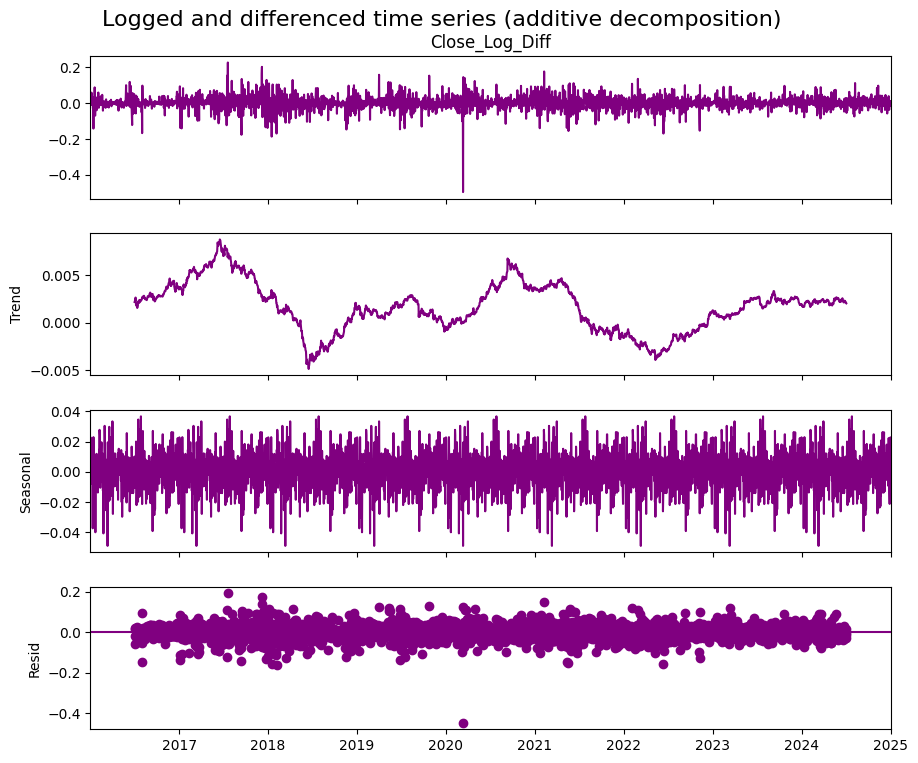

The decompositions were also applied over two specific Bitcoin halving cycles:

- **2016–2020 Halving Period**
  
  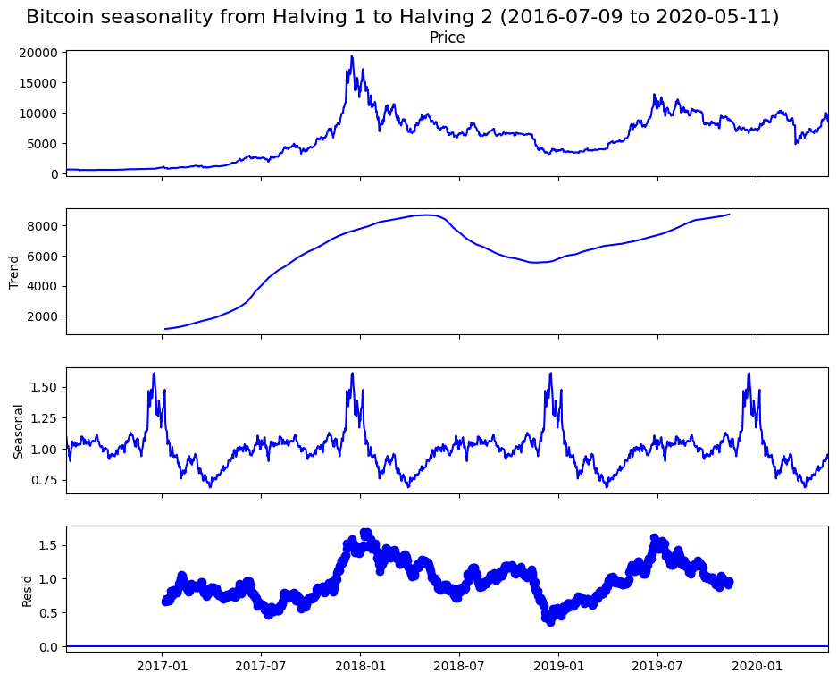
  
- **2020–2024 Halving Period**
  
  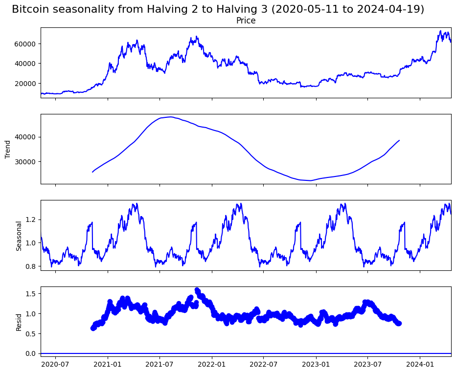
  
##### Insights from Decomposition
- **Trend**: A clear upward trajectory in Bitcoin prices over both periods.
- **Seasonality**: Seasonal patterns were weak but slightly more pronounced during the 2020–2024 period.
- **Residuals**: Volatility is a dominant feature of Bitcoin prices, with significant residual components even after transformations.

#### Partial Autocorrelation Analysis (PACF)
The **PACF plot** for the series showed a sharp drop after lag 1, suggesting that the series can be well-represented by an **AR(1)** model. This indicates that the current value of Bitcoin prices is primarily influenced by its immediate previous value, with negligible impact from higher lags.

  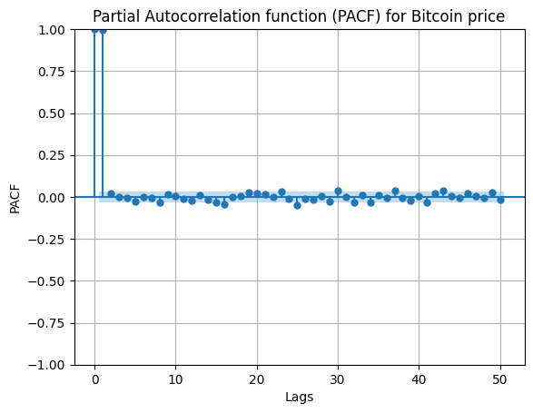

  
### Modeling

#### Moving Average

  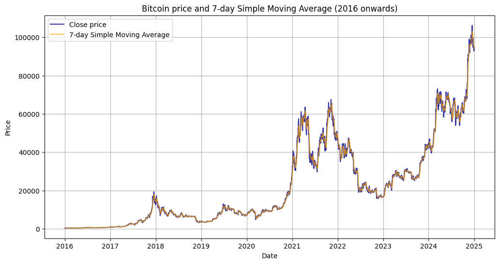
  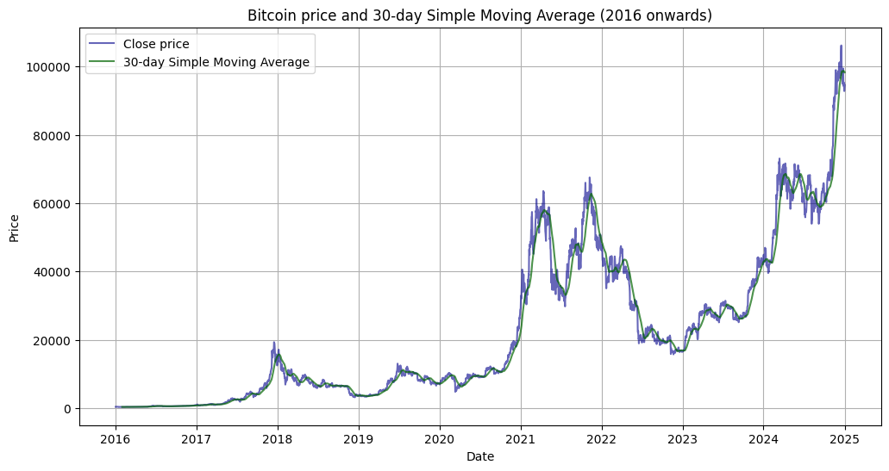
  
#### Exponential Moving Average
The **EMA** is more responsive to recent changes in the data compared to a simple moving average (SMA), which gives equal weight to all data points in the window. Here, the only thing to do, was to properly adjust the **smoothing factor (α)** by minimizng the mean squared error and saving reasonable insight into past values by this function. Eventually, the value **0.8** was selected, yielding the MAE of **66.8141 ($)**, which seems to be sensible choice - compromise between volatility and past values significance.

 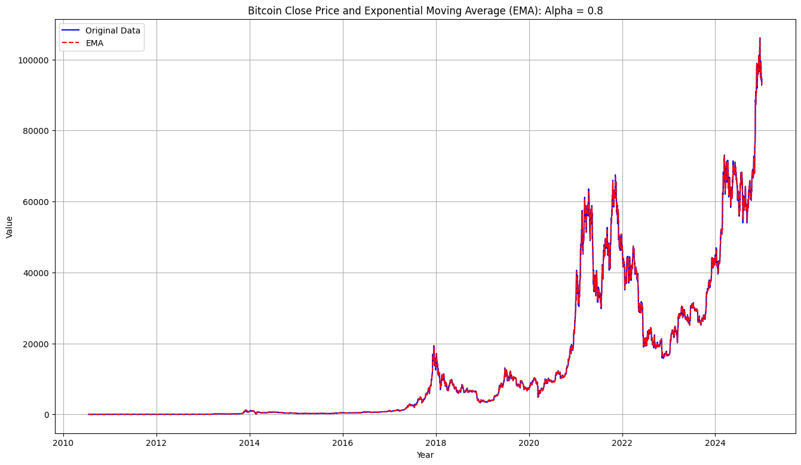

#### Classic ML Models

#### ARIMA 
ARIMA was applied as a baseline model to explore its capability. Unfortunately, the model struggled with Bitcoin price prediction, likely due to the high volatility and non-stationarity of the data. Its performance highlighted the need for more advanced or non-linear models, like Prophet or GARCH, for handling Bitcoin's complex behavior.

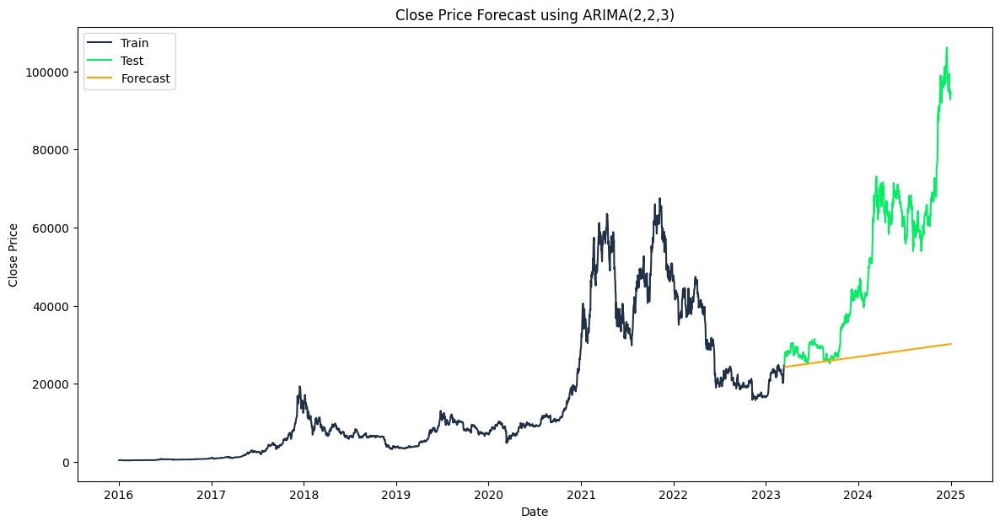

We performed rolling mean and standard deviation analysis for the `Close_Log_Diff` series using different periods: 91 days, 30 days, and 7 days. The results showed that a rolling window of 7 days provided the best fit for capturing short-term trends and fluctuations in the data. Longer periods, such as 91 and 30 days, smoothed the data excessively, making it less effective for analyzing short-term variability.

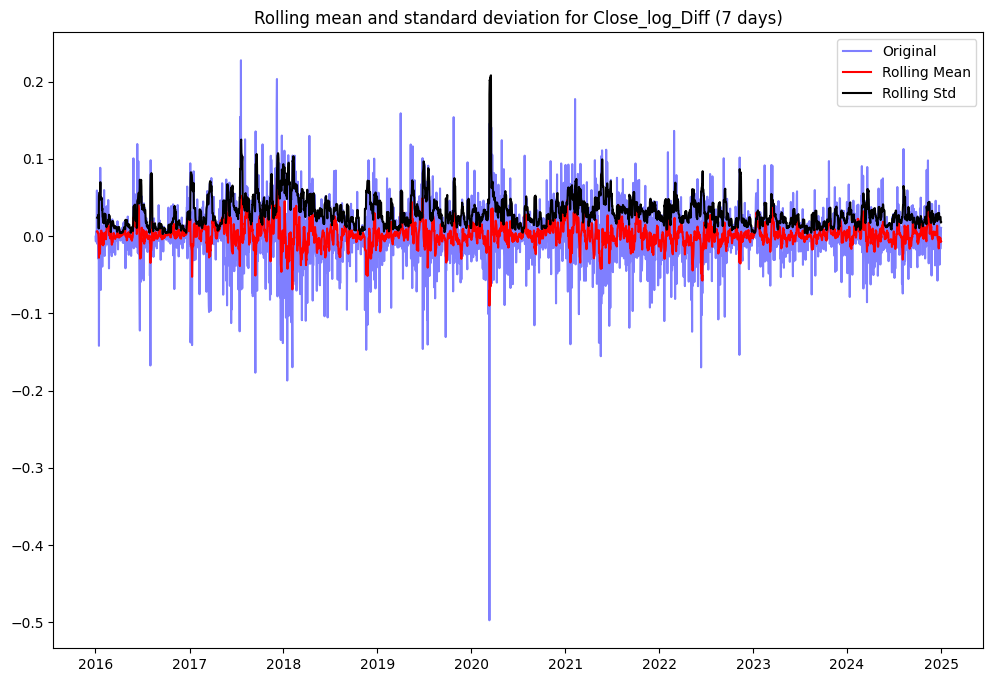

We used a rolling forecast with the **ARIMA(5,1,0)** model, which closely matched the actual Bitcoin price data. This method updates the model with each new observation and forecasts the next, making it well-suited for capturing short-term trends in volatile data like Bitcoin.
The rolling forecast adapts dynamically to new data, providing accurate short-term predictions despite Bitcoin's high volatility.

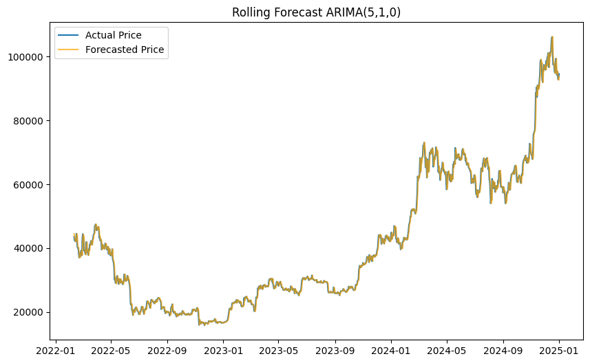

#### GARCH
This model is commonly used for forecasting and modeling financial time series data, particularly in cases where volatility is important. Unlike models that focus purely on predicting prices, GARCH models aim to model the time-varying volatility that often occurs in financial markets. This is particularly useful for modeling asset returns, such as Bitcoin prices, which can experience significant fluctuations in volatility over time.

We used **GARCH(1,3)**, the decision was made based on the code which counted the best model for our data.

.png)

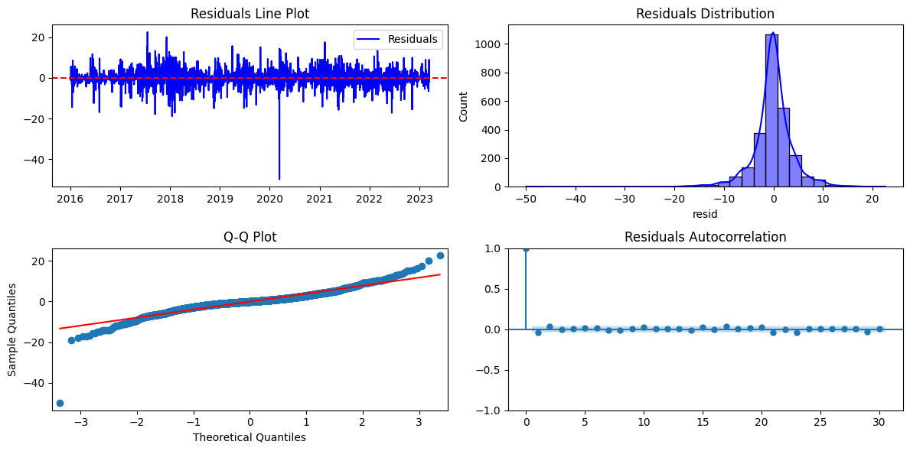

Moreover, we used **GARCH(1,1)** for predicting volatility using only the last year from the data as well as the last month from the data. All of the plots has shown straigh or almost straigh line. That is why wwe decided to do the rolling forecasts for GARCH.

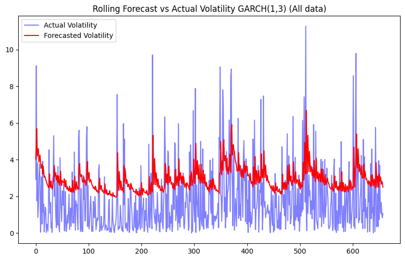

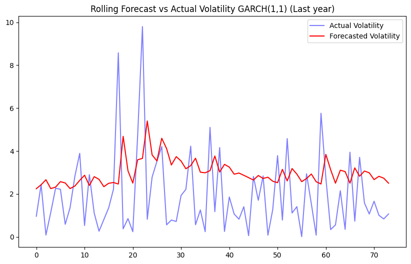

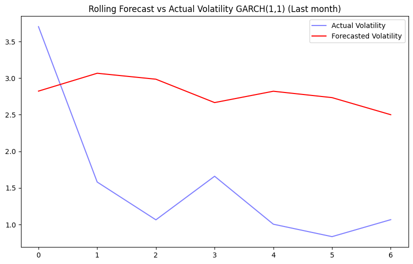

The rolling forecasts of volatility using the GARCH model provided a more dynamic view of how Bitcoin's volatility changes over time. It workd fine for the 'all data' and for the 'last year'. Unfortunately it does not cover with the data of the 'last month'.

#### LSTM & GRU
Long-short-term memory models are extremely powerful time-series models. Due to their architecture, they can predict an arbitrary number of steps into the future. The major factor that distinguishes them from other neural networks is their recurrent setting, which on the high level, may be perceived as training several neural networks which, working sequentially (in loops), communicate with each other on the way. The family of RNN is formed by Long Short Term Memory (LSTM) & Gated Recurrent Unit (GRU) models.

We use both of them to predict feature **Price**/**Close** of Bitcoin, applying different layers, neuron units, time period predicted, training data volume, usage of several features and so on. We visualized the results plotting the actual vs predicted lines on top of each other. In general, to select the most efficient and well-adjusted model we used several metrics: **RMSE**, **MAE**, **R2**, **MSLE**, **MAPE** with special focus on **RMSE** as the simple yet insightful residual analysis method.

The models we examined were:

| Model Description | RMSE | MAE | R² Score | MSLE | MAPE |
|------------------|------|-----|---------|------|------|
| **Model 1 New LSTM architecture (whatever it means...) 0.8/0.2** | 4279.11 | 3399.72 | 0.9178 | 0.002309 | 19.90% |
| **Model 2 Increased units from 125 → 256 0.8/0/2** | 4071.47 | — | — | — | — |
| **Model 3 Default simplest model 0.8/0/2** | 4009.40 | 3428.78 | 0.9279 | 0.002376 | 20.74% |
| **Model 4 GRU (units=256), n_steps=120, from 2016-07-09, 50 epochs** | 3803.78 | 3231.33 | 0.9351 | 0.002117 | 20.73% |
| **Model 5 n_steps = 120** | 3127.70 | 2517.05 | 0.9561 | 0.001420 | 20.78% |
| **Model 6 Extended training data by one year** | 3060.83 | 2381.87 | 0.9580 | 0.001235 | 20.45% |
| **Model 7 (GRU, 50 Epochs, StandardScaler, early stopping, NO dropouts, Close, batchsize=32, n_steps=120, RMSprop)** | 2823.36 | 1452.78 | 0.9815 | 0.001752 | 61.78% |
| **Model 8 (GRU, 50 Epochs, MinMaxScaler, early stopping, NO dropouts, Close, batchsize=32, n_steps=60, RMSprop)** | 2689.83 | 1915.69 | 0.9833 | 0.002702 | 60.97% |
| **Model 9 (GRU, 50 Epochs, StandardScaler, early stopping, dropouts, Close, batchsize=32, n_steps=120, RMSprop)** | 2611.39 | 1865.43 | 0.9842 | 0.003290 | 63.39% |
| **Final Model (GRU, 125 Units, 100 Epochs, MinMaxScaler, NO early stopping, NO dropouts, Close, batchsize=64, n_steps=60, RMSprop) YEARLY PREDICTIONS (2024-01-10 - 2024-12-31)** | **1903.58** | **1366.47** | **0.9827** | **0.000796** | **23.06%** |

*most of these scores are saved in the file **sth** on the branch **sth**

After retraining **LSTM** and **GRU** for **1000+ days predictions**, the results improved as compared to yearly predictions performed and documented above:
**1000+ days forecast:**

| Model Description | RMSE | MAE | R² Score | MSLE | MAPE |
|------------------|------|-----|---------|------|------|
|**GRU 125 Units + 50 Epochs** | 1789.62 | 1353.18 | 0.9931 | 0.001575 | 63.60% |
|**LSTM 125 Units + 50 Epochs** | **1759.30** | **1169.44** | **0.9933** | **0.001244** | **63.61%** |

In this case, LSTM performs slightly better in all key metrics, though the difference is small. Also, the computational cost between both is unobservable, providing aditional advantage to LSTM.

Best (longterm forecast) model visualization:

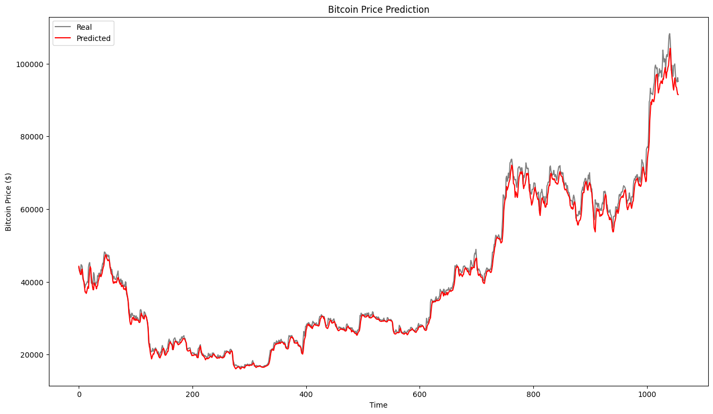

#### Prophet

The image is a time series forecast generated using Facebook **Prophet**, a forecasting model designed for handling trends, seasonality, and uncertainty in time series data. The data shows an overall upward trend with periodic spikes and declines, suggesting **seasonality** and external influencing factors. Noticeable peaks occur around 2018, 2021, and 2024, followed by declines, indicating **cycles of rapid growth** and corrections. The model predicts continued strong growth in 2024 and 2025, with an increasing trajectory. The **confidence interval widens** as the forecast extends further into **the future**, reflecting greater uncertainty.

The Prophet model appears to capture the general trend effectively, though some high-volatility points deviate from the predicted range. The forecast suggests a continuation of previous cycles, projecting an **upward movement** while accounting for fluctuations.

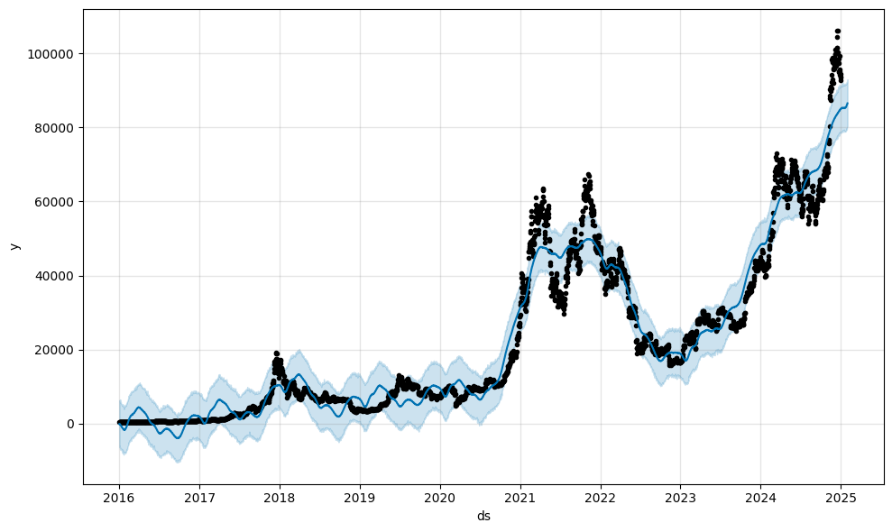

**Inspirations:**
- https://www.geeksforgeeks.org/bitcoin-price-prediction-using-machine-learning-in-python/
- https://towardsdatascience.com/demystifying-cryptocurrency-price-prediction-5fb2b504a110
- https://facebook.github.io/prophet/docs/quick_start.html#python-api
- https://datascientest.com/en/facebook-prophet-all-you-need-to-know
- https://stats.stackexchange.com/questions/423238/arima-rolling-window
- https://medium.com/@yennhi95zz/a-guide-to-time-series-models-in-machine-learning-usage-pros-and-cons-ac590a75e8b3
