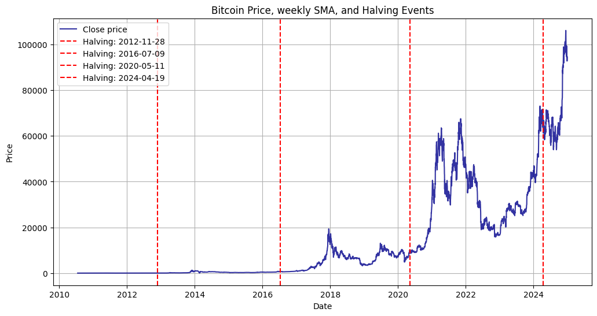
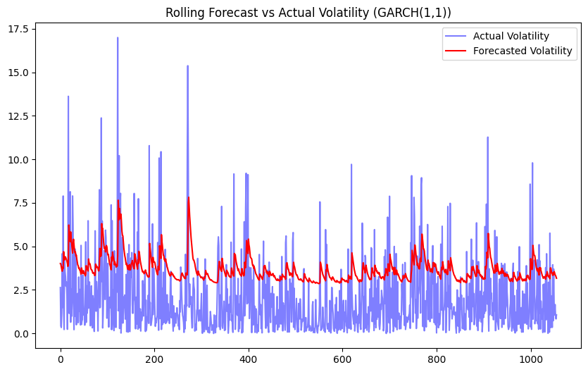
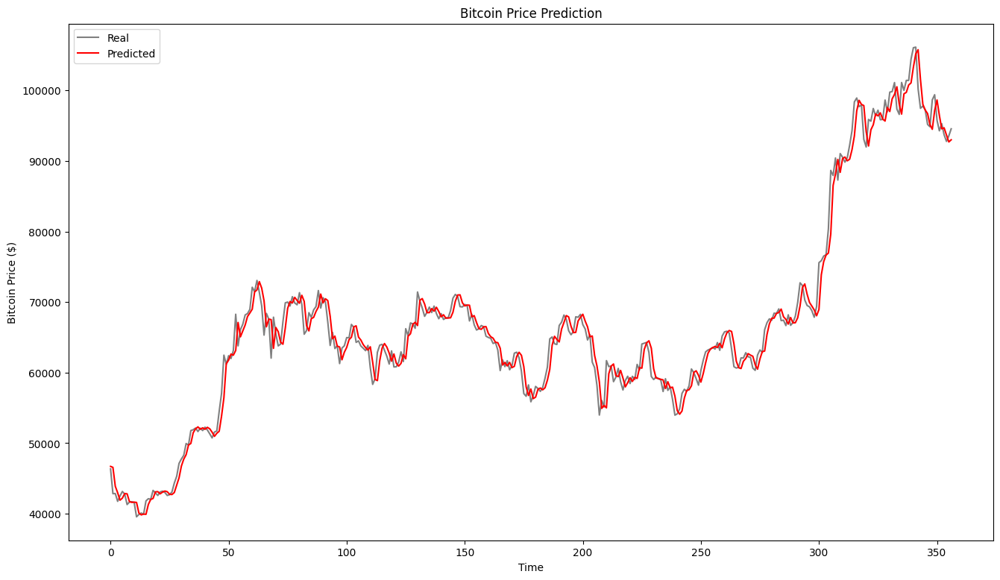

# Time Series Analysis: Bitcoin Prices Data

*This project aims to analyze Bitcoin Prices Data (2010-2024) to uncover trends and predict feature prices utilizing Time Series Analysis techniques.*

## The dataset
[Our dataset](https://www.investing.com/crypto/bitcoin/historical-data) contains six columns: **Date**, **Price**, **Open**, **High**, **Low** and **Vol.** Its records encompass daily changes in the aforementioned metrics, starting from 2010-07-18, up to 2024-12-31.

## Team:
- Kornelia Dołęga-Żaczek: *classic ML methods experimentations, LSTM & GRU fine-tuning, Prophet, ...*
- Jacek Kała: *preprocessing, initial MA & EMA, baseline LSTM & GRU*
- Maria Leszczyńska: *decompostion, seasonality checks, stationarity analysis, visualization, smoothing, Prophet, Holt-Winters model (and RF which was a bad experiment)*
- Wioletta Wielakowska: *GARCH & ARIMA model: preparation, fine-tuning, description*

---

### Data Preprocessing
Several data inconsistencies where identified, restricting proper analysis. After disposing of the duplicated index column, the following steps were applied:
- replacing "," with empty strings, as the original data used it as the hundreds separator (columns:  **Price**, **Open**, **High**, **Low**). After that, their datatypes were replaced with floating points
- reshaping the **Date**, modifying the structure from *mm-dd-YYYY* to *YYYY-mm-dd* as the universally recognized standard, ensuring the datetime format, then sorting and setting it as the index column
- constructing new column: **Average** as the average of **High** and **Low**, which was supposed to be a more reliable metric. Ultimately, for prediction we use **Price**
- renaming columns: **Price** to **Close**, **Vol.** to **Volume**
- reconstructing **Volume** to handle *K*, *M* and *B* quantifiers, and expand them with thousand, million, billion, receiving valid numbers. This column was used in initial experimentations with time-series based neural networks
- *MinMaxScaling* was used separately before every model training, the rectified dataset was saved as **bitcoin_preprocessed**

No other anomalies or missing values were recognized.

### Data Exploration

#### Stationarity check - Augmented Dickey–Fuller Test & Seasonality Checks
...

#### Differencing, Logging & Logging Followed by Differencing
...

#### Frequency by Time Period
...

#### Decompositions
...

#### Auxilary Plots
...

**Dodaj tu obrazki i krótkie opisy, które twoim zdaniem mają sens, bo jest ich tam tyle, że nie wiem za bardzo co się dzieje**

### Modeling

#### Moving Average

#### Exponential Moving Average
The EMA is more responsive to recent changes in the data compared to a simple moving average (SMA), which gives equal weight to all data points in the window. The **time window** was set to **50**, the only thing was to properly adjust the **smoothing factor** by minimizng the mean squared error. Eventually, the value **0.1** was selected, yielding the MSE of **0.00002**.

(give the picture!)[link to picture]

#### Classic ML Models

#### GARCH

.png)

#### LSTM & GRU
Long-short-term memory models are extremely powerful time-series models. Due to their architecture, they can predict an arbitrary number of steps into the future. The major factor that distinguishes them from other neural networks is their recurrent setting, which on the high level, may be perceived as training several neural networks which, working sequentially (in loops), communicate with each other on the way. The family of RNN is formed by Long Short Term Memory (LSTM) & Gated Recurrent Unit (GRU) models.

We use both of them to predict feature **Price**/**Close** of Bitcoin, applying different layers, neuron units, time period predicted, training data volume, usage of several features and so on. We visualized the results plotting the actual vs predicted lines on top of each other. In general, to select the most efficient and well-adjusted model we used several metrics: **RMSE**, **MAE**, **R2**, **MSLE**, **MAPE** with special focus on **RMSE** as the simple yet insightful residual analysis method.

The models we examined were:

| Model Description | RMSE | MAE | R² Score | MSLE | MAPE |
|------------------|------|-----|---------|------|------|
| **Model 1 New LSTM architecture (whatever it means...) 0.8/0.2** | 4279.11 | 3399.72 | 0.9178 | 0.002309 | 19.90% |
| **Model 2 Increased units from 125 → 256 0.8/0/2** | 4071.47 | — | — | — | — |
| **Model 3 Default simplest model 0.8/0/2** | 4009.40 | 3428.78 | 0.9279 | 0.002376 | 20.74% |
| **Model 4 GRU (units=256), n_steps=120, from 2016-07-09, 50 epochs** | 3803.78 | 3231.33 | 0.9351 | 0.002117 | 20.73% |
| **Model 5 n_steps = 120** | 3127.70 | 2517.05 | 0.9561 | 0.001420 | 20.78% |
| **Model 6 Extended training data by one year** | 3060.83 | 2381.87 | 0.9580 | 0.001235 | 20.45% |
| **Model 7 (GRU, 50 Epochs, StandardScaler, early stopping, NO dropouts, Close, batchsize=32, n_steps=120, RMSprop)** | 2823.36 | 1452.78 | 0.9815 | 0.001752 | 61.78% |
| **Model 8 (GRU, 50 Epochs, MinMaxScaler, early stopping, NO dropouts, Close, batchsize=32, n_steps=60, RMSprop)** | 2689.83 | 1915.69 | 0.9833 | 0.002702 | 60.97% |
| **Model 9 (GRU, 50 Epochs, StandardScaler, early stopping, dropouts, Close, batchsize=32, n_steps=120, RMSprop)** | 2611.39 | 1865.43 | 0.9842 | 0.003290 | 63.39% |
| **Final Model (GRU, 125 Units, 100 Epochs, MinMaxScaler, NO early stopping, NO dropouts, Close, batchsize=64, n_steps=60, RMSprop) 3 MONTHS PREDICTIONS** | **1903.58** | **1366.47** | **0.9827** | **0.000796** | **23.06%** |

Best model visualization:

#### Prophet

________________________
zobaczyc sobie modele wykladnicze,
zmienic zbior danych na odstep do dzien (closing price) - Wiola,
sprawdzic outliery - Maria,
sprawdzic seasonality/trendy w danych - Maria,
podzielic dataset na podzbiory - Kornelia,
-- po zrobieniu modelu/modeli:
residual analysis with conclusions - ,
statistical tests,
forecasting based on the model and verfication of the forecast
